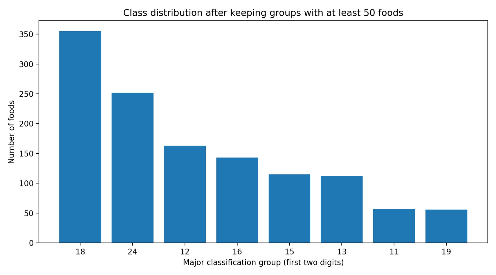
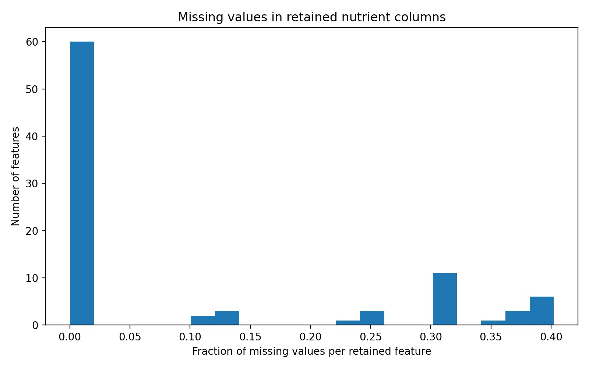
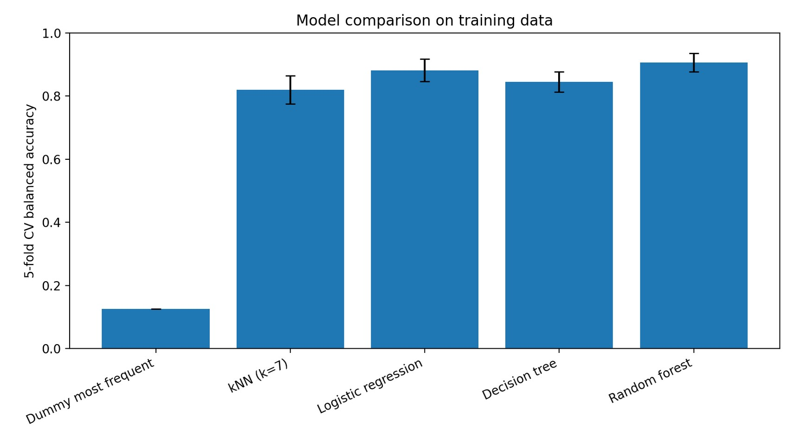
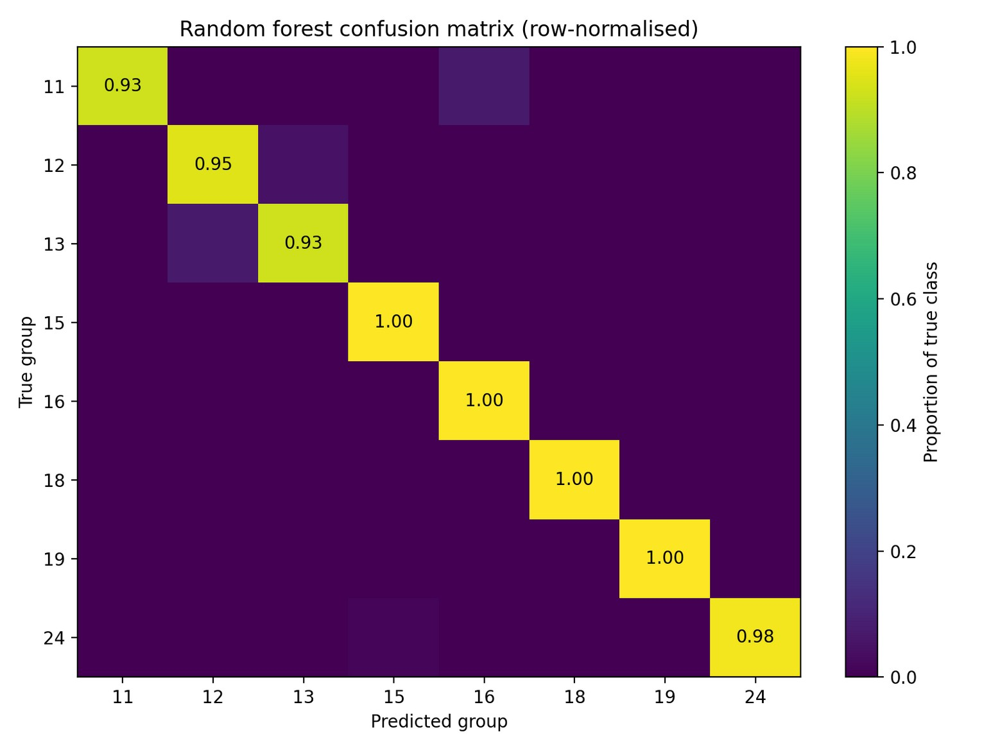
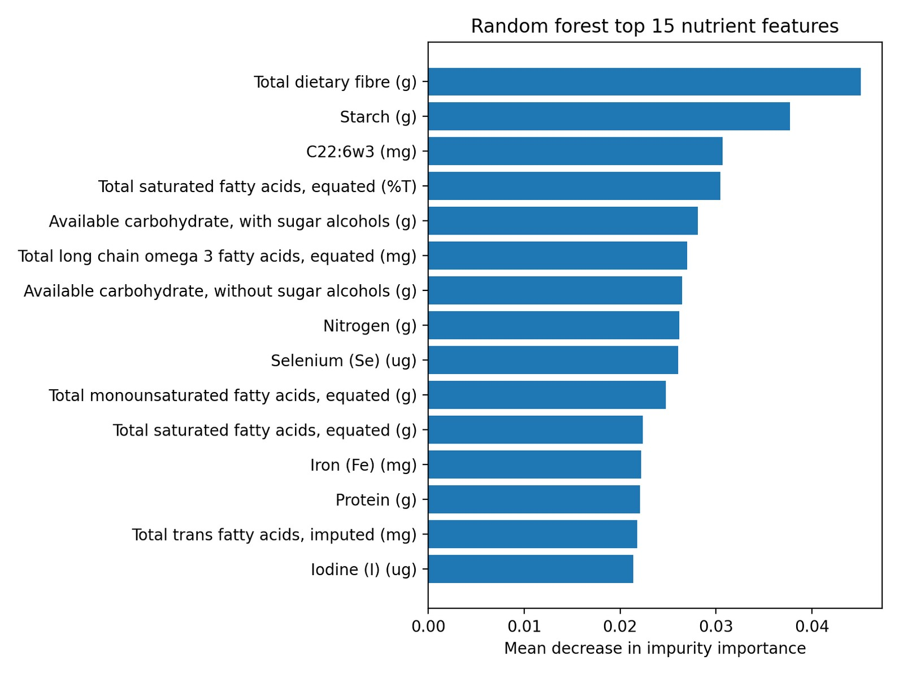

# Food Group Prediction from Nutrient Profiles

A machine learning project exploring whether the nutritional composition of a
food item can be used to predict its broad food classification group.

Using data from the **Australian Food Composition Database (AFCD)**, I built
and compared several multi-class classification models and analysed both their
predictive performance and the nutrient features contributing to their decisions.

---

## Project Overview

The main research question was:

> **Can the nutrient profile of a food item be used to predict its broad food classification group?**

The task was formulated as a multi-class classification problem using numerical
nutrient information only.

To keep the experiment focused on nutrient composition, food names and other
label-related fields were excluded from the model inputs. This prevents the model
from relying on obvious textual clues such as "bread", "milk", or "beef" instead
of learning patterns in the nutrient data.

After preprocessing, the final dataset contained:

- **1,253 food items**
- **90 numerical nutrient features**
- **8 broad food groups**

---

## Machine Learning Workflow

The project follows a complete supervised machine learning pipeline:

1. Defined a broad food-group target from the food classification code
2. Removed label-related and administrative fields
3. Retained numerical nutrient features only
4. Removed very small food groups for more stable evaluation
5. Used a stratified train/test split
6. Applied median imputation to missing nutrient values
7. Standardised features for scale-sensitive models
8. Compared multiple classification algorithms
9. Used 5-fold cross-validation on the training set
10. Evaluated the final models on a held-out test set
11. Analysed Random Forest feature importance

---

## Models

Five models were compared:

- Dummy Classifier
- k-Nearest Neighbours
- Logistic Regression
- Decision Tree
- Random Forest

These models were selected to compare simple baselines, linear models,
distance-based methods, and non-linear tree-based approaches.

---

## Results

| Model | CV Balanced Accuracy | Test Accuracy | Test Balanced Accuracy |
|---|---:|---:|---:|
| Dummy Classifier | 0.125 | 0.283 | 0.125 |
| kNN (k=7) | 0.820 | 0.889 | 0.837 |
| Logistic Regression | 0.882 | 0.927 | 0.918 |
| Decision Tree | 0.845 | 0.924 | 0.903 |
| **Random Forest** | **0.906** | **0.981** | **0.974** |

The **Random Forest** achieved the strongest overall performance:

- **Test Accuracy:** 0.981
- **Test Balanced Accuracy:** 0.974
- **Macro F1 Score:** 0.976

Balanced accuracy and macro F1 were particularly important because the retained
food groups were not equally represented.

---

## Exploratory Data Analysis

### Class Distribution

The selected food groups remain moderately imbalanced, which motivated the use
of balanced accuracy rather than relying only on ordinary accuracy.



### Missing Values

Some nutrient variables contain substantially more missing values than others.

Median imputation was used because nutrient measurements can contain large
outliers, making the median less sensitive than the mean.



---

## Model Comparison

The comparison shows that all learned models perform substantially better than
the dummy baseline.

Logistic Regression also performs strongly, suggesting that many broad food
groups can be separated using relatively simple combinations of nutrient values.

The Random Forest provides the best overall performance, suggesting that
non-linear relationships and interactions between nutrient variables are also
useful for classification.



---

## Random Forest Evaluation

### Confusion Matrix

The row-normalised confusion matrix shows that most predictions fall on the
diagonal, indicating strong performance across the different retained food groups.



---

## Feature Importance

Random Forest feature importance was used to investigate which nutrient variables
contributed most strongly to the model.

Important features included:

- Total dietary fibre
- Starch
- C22:6w3
- Saturated fatty acids
- Available carbohydrate
- Long-chain omega-3 fatty acids
- Nitrogen
- Selenium
- Monounsaturated fatty acids
- Iron
- Protein
- Trans fatty acids
- Iodine



These variables are nutritionally meaningful and suggest that the classifier is
using relevant nutrient information rather than arbitrary columns.

Feature importance is interpreted as **predictive importance**, not as evidence
of a causal relationship between a nutrient and a food category.

---

## Preventing Data Leakage

One of the most important modelling decisions was excluding food names and
detailed food descriptions.

Using features such as:

- bread
- milk
- beef
- apple

could allow the model to infer the target directly from language instead of
learning from nutrient composition.

Removing these fields makes the experiment better aligned with the research
question and provides a more meaningful test of the nutrient features.

---

## PCA Consideration

Principal Component Analysis (PCA) was considered as a dimensionality-reduction
approach but was not used in the final models.

The main reasons were:

- The 90-feature dataset was still computationally manageable
- PCA components would make nutrient-level interpretation more difficult
- Random Forest can model non-linear interactions without requiring uncorrelated inputs

For this project, interpretability was prioritised over reducing the number of
features.

---

## Limitations

The results should be interpreted within the scope of the experiment.

- Food groups with fewer than 50 samples were excluded
- The task predicts broad food groups rather than detailed food categories
- Median imputation is a relatively simple missing-data strategy
- Only a moderate number of models and hyperparameters were explored
- The relationship between nutrient composition and food category is naturally strong, so high classification performance is expected

Future work could include:

- Hyperparameter optimisation
- Alternative missing-value strategies
- Reduced-feature Random Forest models
- More detailed food-category prediction
- Comparison with additional ensemble or neural-network models

---

## Technologies

- Python
- NumPy
- pandas
- scikit-learn
- Matplotlib
- Machine Learning
- Multi-class Classification
- Cross-validation
- Feature Importance
- Model Evaluation

---

## Repository Structure

```text
food-group-prediction/
├── README.md
├── methods/
│   └── METHODS.md
├── report/
│   └── COMP4702_ML_Assignment_Portfolio.pdf
└── results/
    ├── class_distribution.png
    ├── missing_values.png
    ├── model_comparison.png
    ├── confusion_matrix.png
    ├── feature_importance.png
    └── model_results.csv
